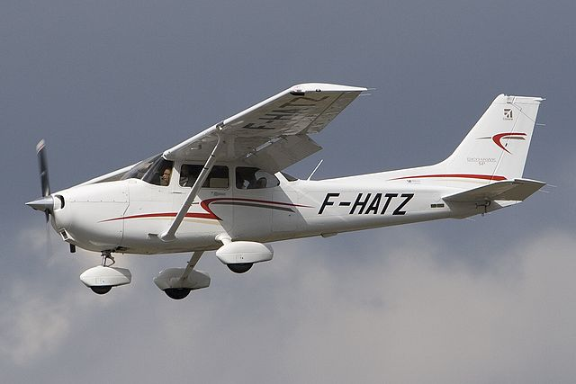
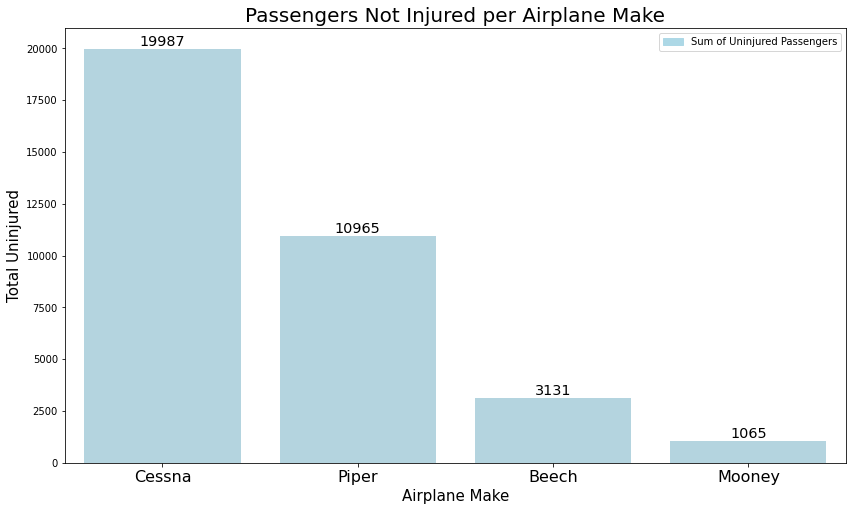

# Airplane Safety Data Analysis

**Author**: [Jack Locke](mailto:jackdlocke@gmail.com)



## Overview
This project will be analyzing airplane safety based on factors of risk such as aircraft damage and passenger injury severity. My analysis will focus on recommending what airplane makes, models, and number of engines will be best suited for the stakeholder's business when compared to said factors of risk. The increased safety of the airplanes sold will improve company reliability resulting in increased sales/growth for the business. I will be using the CRISP-DM (Cross-industry standard process for data mining) methodology for my analytics model. 

* 1. Business Problem
* 2. Data Understanding
    * Limitations
* 3. Data Preparation
    * a. Columns to drop
    * b. Narrowing dataset to small instructional airplanes
    * c. Remaining missing/null values
    * d. Consolidate top makes and models
* 4. Analysis
    * a. Make vs. uninjured passengers
    * b. Model vs. serious and fatal injuries
    * c. Number of engines vs. fatalities
* 5. Conclusion
* 6. Next Steps


## Business Understanding
The business stakeholders are a company that is selling small airplanes for instructional purposes in the US. They are focused on selling airplanes that pose the least amount of risk to their customers from a safety perspective. This is because accidents occur more frequently during instructional training than in other airplane markets, making safety that much more important to their customers. Selling the safest airplanes in this market should lead to increased sales/growth for the company. I will be analyzing airplane safety by looking at data from small instructional airplane accidents. I will be focusing on what the stakeholders can control, such as make, model, and number of engines and compare those with our factors of safety/risk.  

## Data Understanding
The dataset from the National Transportation Safety Board includes data from 1962 to 2023 about civil aviation accidents and selected incidents in the United States and international waters. The dataset can be found here on kaggle https://www.kaggle.com/datasets/khsamaha/aviation-accident-database-synopses. The dataset contains over 90,000 reported accidents for all types of aircrafts. Each row represents an accident, giving information on the make, model, number of engines, aircraft damage, fatalities, injuries, non-injured etc. I will need to reduce this dataset to just small instructional airplanes for the purpose of our business problem. This dataset will help us in solving our business problem because we can see how safe the airplanes are for passengers when an accident occurs.  
### Limitations
But the dataset also possesses many limitations. I do not know the availability of the aircrafts, the cost of the aircrafts, the number of flights per aircraft, the mileage per aircraft, or any information on maintenance. Without this information I cannot say with absolute confidence which airplanes are the safest or best suited for the company (maybe the safest airplane has never been in an accident so it isnt in our dataset). I can only determine which airplanes are the most highly represented when compared to factors of risk. This will help show us trends and patterns in the data. From there, I can recommend what actions need to be taken in the future in order to confirm my suspicions on which airplanes are the safest. 


## Data Preparation
* Drop all unnecessary columns from the dataframe. 
* Narrow our dataset to small instructional airplanes; handling missing/null values along the way. 
* Handle any remaining missing/null values. 
* Consolidate our dataset to the most highly represented makes and models so it can be analyzed in the next section. 


## Analysis
I am looking at airplanes that suffered substantial damage or were completely destroyed as I consider that to be a serious accident. Being able to see how many people are uninjured in a serious accident helps show the safety/risk of an airplane's make. Of course, as I mentioned earlier, due to the limitations of the dataset, I can not say with certainty these will be the safest makes but only that these are the most highly represented makes. For now, we would recommend looking into this airplane makes further. 


Again, I want to look at a serious accident when assessing the airplane model safety/risk. I already assessed the makes that will result in the most amount of uninjured passengers given enrichment of our data in the next steps. If I am able to see the safest makes based on non-injured passengers, then matching the corresponding models that have the least amount of fatalities and serious injuries will give us a make/model that has the best chance of passengers only suffering a minor injury or, preferably, no injury at all. But, as I have mentioned, due to the limitations of the dataset I cannot confirm this are the safest models but only that these are the most highly represented models. For now, I would recommend looking into this airplane makes and their corresponding models further. 


I want to look at the total number of fatalities by engine number for small airplanes because this gives me the best indication of how to make the plane the safest operationally. If an engine has a failure, you are limited to your glide ratio and where you can land. Logically speaking, I assume that having two engines would be safer than one because in the event of an engine failure, you still have one engine that can extend your glide ratio. I recommend looking into these fatality numbers further in our next steps. 


## Conclusions
My analysis presents three business findings. These findings can help the business figure out which airplanes will be the safest for their customers. Which, in turn, will help increase their sales of small instructional airplanes and help grow their comapny. Given these findings, I can build on our recommendations and know where to proceed next given data enrichment in the future. I am showing which makes, models, and number of engines are the most highly represented in relation to our factors of risk such as total uninjured, total serious and total fatal injuries.  

* 1. When assessing airplane make safety, I compared the total number of uninjured passengers to airplane makes involved in serious accidents; **I recommend looking further into the following makes in order to confirm which have the most uninjured passengers per accident: Cessna, Piper, Beech, and Mooney.** 
* 2. When assessing airplane model safety that will correspond with the safest makes, I compared the total number of serious and fatal injuries to airplane models involved in serious accidents; **I recommend looking further into the following models in order to give passengers the smallest chance of fatal/severe injury per accident**: 
    * **Piper- PA38, PA22, PA18, PA24, PA32, PA28** 
    * **Cessna- C180, C152, C210, C150, C182, C172**
    * **Beech- Be58, Be23, Be95, Be36, Be35**
    * **Mooney- M20**
* 3. When assessing the total number of fatalities based on one or two engines, I assume two engines are better than one due to the increase time/glide ratio that will give the plane a better chance of a safer landing. Due to the limitations of the dataset, I cannot be certain this is the case. **I recommend looking into the number of fatalities per number of engines further, given the enrichment of our data, to confirm two engines are better than one, thus making the airplane safer.** 


### Next Steps
Further enrichment of the data will help us confirm our business recommendations. At this time, I do not know if their high representation means they are the least safe so they are involved in the most accidents. If it means they are the safest so they are flown the most, resulting in more accidents. Or maybe they are flown the most for other reasons? Is it because they are the most available? Is it because they are the cheapest?

In the next steps, I would suggest enhancing the dataset by finding more data on make/model/engine: 

* availability
* cost
* total flights
* total mileage
* maintenance

With the increased information, I can more confidently confirm which makes, models, and number of engines will be the safest. Given that information, I can suggest which airplanes would be best suited for the company based on safety/risk. Additionally, I can start to confirm these are the most well suited airplanes in relation to cost and availability as well. Then the company will know which small instructional aircrafts will be of best service for their business. 


## For More Information

See the full analysis in the [Jupyter Notebook](airplane_safety.ipynb) or review this [pres]

For additional info, contact Jack Locke at [jackdlocke@gmail.com](mailto:jackdlocke@gmail.com)


## Repository Structure

```
├── data
├── images
├── README.md
├── presentation.pdf
└── airplane_safety.ipynb
```
